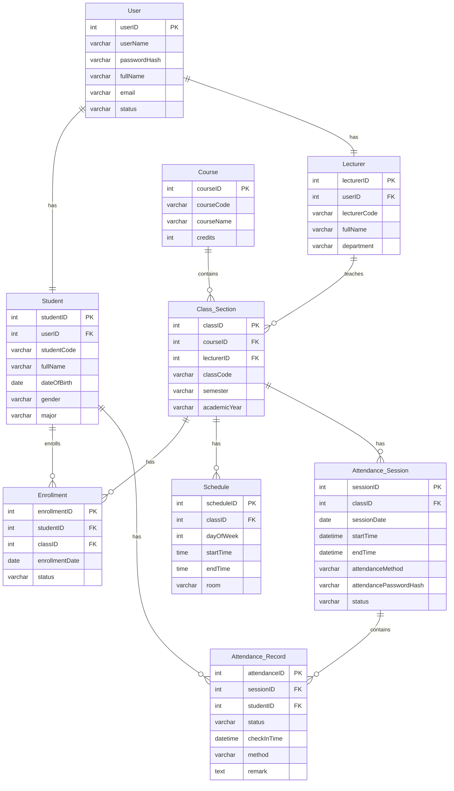

# Data Model – Student Attendance System

## 1. Overview

The Data Model represents the logical data structure of the Student Attendance System. It is derived from the finalized Class Diagram and describes the main entities, their attributes, primary keys, foreign keys, and relationships.

The data model contains 9 main entities:

- User
- Student
- Lecturer
- Course
- Class Section
- Enrollment
- Schedule
- Attendance Session
- Attendance Record

---

## 2. Data Model / Data Dictionary

### 2.1 User

| Field | Data Type | Key | Description |
|---|---|---|---|
| userID | int | PK | Unique identifier of a user |
| userName | varchar (30) | | Username used for login |
| passwordHash | varchar (255) | | Hashed account password |
| fullName | varchar (30) | | Full name of the user |
| email | varchar (100) | | Email associated with the account |
| status | varchar (20) | | Account status |

### 2.2 Student

| Field | Data Type | Key | Description |
|---|---|---|---|
| studentID | int | PK | Unique identifier of a student |
| userID | int | FK | References User.userID |
| studentCode | varchar (20) | | Student identification code |
| fullName | varchar (100) | | Full name of the student |
| dateOfBirth | date | | Student date of birth |
| gender | varchar (10) | | Student gender |
| major | varchar (100) | | Student major |

### 2.3 Lecturer

| Field | Data Type | Key | Description |
|---|---|---|---|
| lecturerID | int | PK | Unique identifier of a lecturer |
| userID | int | FK | References User.userID |
| lecturerCode | varchar (20) | | Lecturer identification code |
| fullName | varchar (100) | | Full name of the lecturer |
| department | varchar (100) | | Lecturer department |

### 2.4 Course

| Field | Data Type | Key | Description |
|---|---|---|---|
| courseID | int | PK | Unique identifier of a course |
| courseCode | varchar (20) | | Course code |
| courseName | varchar (100) | | Course name |
| credits | int | | Number of credits |

### 2.5 Class Section

| Field | Data Type | Key | Description |
|---|---|---|---|
| classID | int | PK | Unique identifier of a class section |
| courseID | int | FK | References Course.courseID |
| lecturerID | int | FK | References Lecturer.lecturerID |
| classCode | varchar (30) | | Class code |
| semester | varchar (20) | | Semester in which the class is offered |
| academicYear | varchar (20) | | Academic year |

### 2.6 Enrollment

| Field | Data Type | Key | Description |
|---|---|---|---|
| enrollmentID | int | PK | Unique identifier of an enrollment |
| studentID | int | FK | References Student.studentID |
| classID | int | FK | References Class Section.classID |
| enrollmentDate | date | | Date of enrollment |
| status | varchar (20) | | Enrollment status |

### 2.7 Schedule

| Field | Data Type | Key | Description |
|---|---|---|---|
| scheduleID | int | PK | Unique identifier of a schedule |
| classID | int | FK | References Class Section.classID |
| dayOfWeek | int | | Day of the week |
| startTime | time | | Class starting time |
| endTime | time | | Class ending time |
| room | varchar (50) | | Classroom |

### 2.8 Attendance Session

| Field | Data Type | Key | Description |
|---|---|---|---|
| sessionID | int | PK | Unique identifier of an attendance session |
| classID | int | FK | References Class Section.classID |
| sessionDate | date | | Date of attendance session |
| startTime | datetime | | Session start time |
| endTime | datetime | | Session end time |
| attendanceMethod | varchar (20) | | Attendance method |
| attendancePasswordHash | varchar (255) | | Hashed attendance password when password attendance is enabled |
| status | varchar (20) | | Attendance session status |

### 2.9 Attendance Record

| Field | Data Type | Key | Description |
|---|---|---|---|
| attendanceID | int | PK | Unique identifier of an attendance record |
| sessionID | int | FK | References Attendance Session.sessionID |
| studentID | int | FK | References Student.studentID |
| status | varchar (20) | | Attendance status |
| checkInTime | datetime | | Actual attendance submission time |
| method | varchar (20) | | Attendance method |
| remark | text | | Additional lecturer remark |

---

## 3. Relationships and Key References

| Relationship | Cardinality | Description |
|---|---|---|
| User – Student | 1 : 1 | A user account is associated with one student profile. |
| User – Lecturer | 1 : 1 | A user account is associated with one lecturer profile. |
| Course – Class Section | 1 : N | One course can contain multiple class sections. |
| Lecturer – Class Section | 1 : N | One lecturer can teach multiple class sections. |
| Student – Enrollment | 1 : N | A student can have multiple enrollments. |
| Class Section – Enrollment | 1 : N | A class section can have multiple enrollments. |
| Class Section – Schedule | 1 : N | A class section can have multiple schedule entries. |
| Class Section – Attendance Session | 1 : N | A class section can have multiple attendance sessions. |
| Attendance Session – Attendance Record | 1 : N | An attendance session can contain multiple attendance records. |
| Student – Attendance Record | 1 : N | A student can have multiple attendance records. |

### 3.1 Primary Keys

Each entity is identified by a primary key:

- `User.userID`
- `Student.studentID`
- `Lecturer.lecturerID`
- `Course.courseID`
- `Class Section.classID`
- `Enrollment.enrollmentID`
- `Schedule.scheduleID`
- `Attendance Session.sessionID`
- `Attendance Record.attendanceID`

### 3.2 Foreign Keys

The following foreign keys represent references between entities:

- `Student.userID` → `User.userID`
- `Lecturer.userID` → `User.userID`
- `Class Section.courseID` → `Course.courseID`
- `Class Section.lecturerID` → `Lecturer.lecturerID`
- `Enrollment.studentID` → `Student.studentID`
- `Enrollment.classID` → `Class Section.classID`
- `Schedule.classID` → `Class Section.classID`
- `Attendance Session.classID` → `Class Section.classID`
- `Attendance Record.sessionID` → `Attendance Session.sessionID`
- `Attendance Record.studentID` → `Student.studentID`

---

## 4. Attendance-Related Rules

### 4.1 Attendance Session Status

An attendance session follows the following lifecycle:

```text
SCHEDULED → OPEN → CLOSED
```

- `SCHEDULED`: The session has been created but has not reached its start time.
- `OPEN`: Students are allowed to submit attendance.
- `CLOSED`: Students can no longer submit new attendance records.

The system automatically changes the session from `SCHEDULED` to `OPEN` when the scheduled start time is reached.

The lecturer can manually close an `OPEN` session at any time.

If the lecturer does not manually close the session, the system automatically changes it to `CLOSED` when the scheduled end time is reached.

### 4.2 Attendance Status

Attendance records may have the following statuses:

- `PRESENT`
- `LATE`
- `ABSENT`
- `PENDING`

`LATE` is manually assigned by the lecturer.

Students cannot manually modify their own attendance status.

### 4.3 Attendance Method

The system supports two main attendance methods:

- `SELF_SUBMIT`
- `PASSWORD`

For password-based attendance, the attendance password is represented by `attendancePasswordHash`.

---

## 5. ERD



---

## 6. Design Scope

This data model is maintained at the **logical/context design level**.

The model focuses on:

- Entities
- Attributes
- Primary Keys
- Foreign Keys
- Relationships
- Cardinalities
- Main attendance-related data rules

Physical database implementation details such as SQL `CREATE TABLE`, database-specific constraints, indexes, and other implementation-specific configurations are intentionally excluded at this stage.
